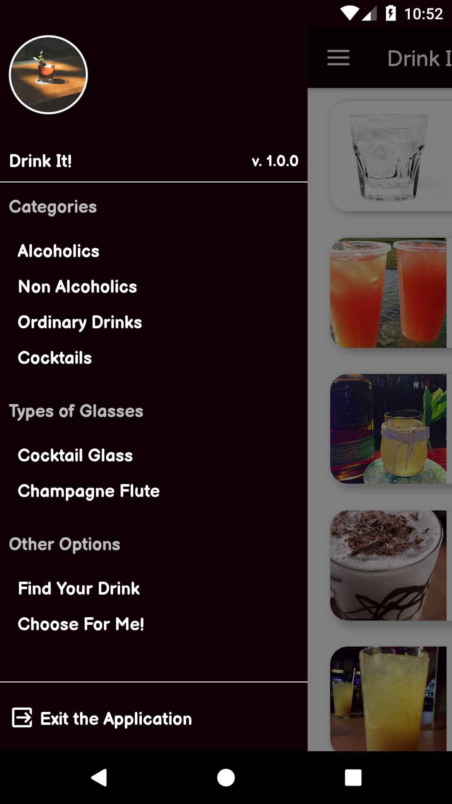

<h1 align="center">
  Drink It!
</h1>

<p align="center">
  <a href="#rocket-project">Project</a>&nbsp;&nbsp;&nbsp;|&nbsp;&nbsp;&nbsp;
  <a href="#computer-technologies">Technologies</a>&nbsp;&nbsp;&nbsp;|&nbsp;&nbsp;&nbsp;
  <a href="#thinking-how-to-use">How to use?</a>&nbsp;&nbsp;&nbsp;|&nbsp;&nbsp;&nbsp;
  <a href="#memo-license">License</a>
</p>

## :rocket: Project

:globe_with_meridians:
Project developed using api https://www.thecocktaildb.com/

## Preview

<div style="display: flex">




</div>

## :computer: Technologies

- [React Native](https://facebook.github.io/react-native/)
- [React Navigation](https://reactnavigation.org/)
- [Axios](https://github.com/axios/axios)
- [Prop-Types](https://github.com/facebook/prop-types)
- [React Native Fetch Blob](https://github.com/joltup/rn-fetch-blob)
- [React Native Share](https://github.com/react-native-community/react-native-share)
- [Styled Components](https://styled-components.com/)
- [React Native Vector Icons](https://github.com/oblador/react-native-vector-icons)
- [Commitlint](https://github.com/conventional-changelog/commitlint)
- [Commitzen](https://github.com/commitizen/cz-cli)
- [Eslint](https://github.com/eslint/eslint)
- [Prettier](https://github.com/prettier/prettier)
- [Husky](https://github.com/typicode/husky)

## :thinking: How to use?

```sh
yarn || npm i
```

```sh
yarn android || npm run android (or change to ios if you use a macosx)
```

## :memo: License

MIT
